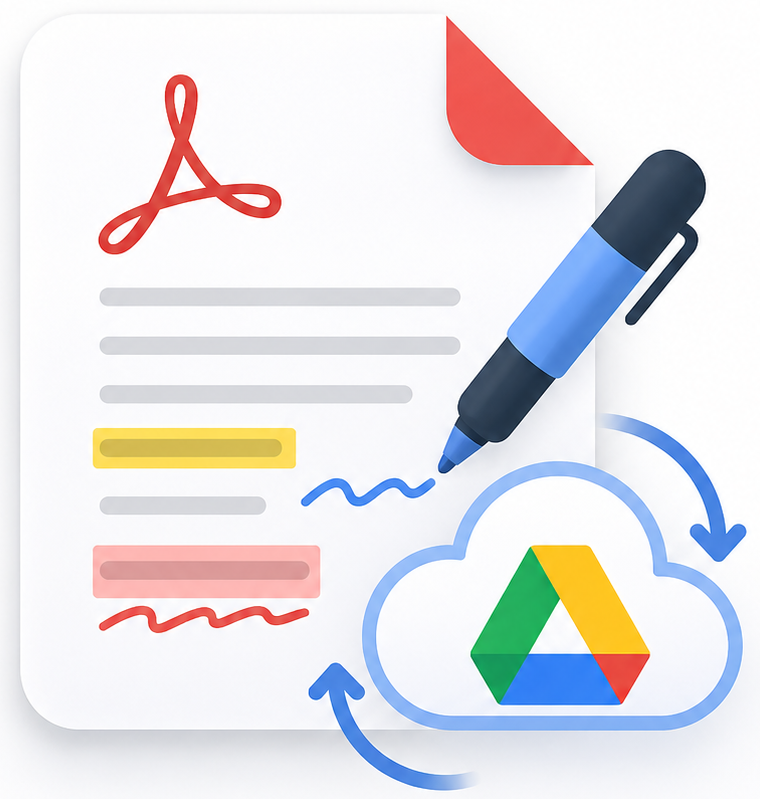

# ReadItOn 📖

**A beautiful, in-browser PDF reader that lets you highlight and annotate your
papers — with everything synced to your own Google Drive, on every device.**

---

## ✨ What you can do

- **Annotate any PDF** — highlight, underline, sticky notes, freehand pen, and typed text boxes.
- **Pick your color instantly** — each tool opens with its own color, ready to change in one click.
- **Everything in your Google Drive** — your papers and notes are stored in a folder you choose, so they follow you to every device.
- **Undo mistakes** — `Ctrl/⌘ + Z` steps back through your annotations.
- **Save when you're ready** — click **Save** (or `Ctrl/⌘ + S`) to write your changes to Drive.
- **Export** a flattened PDF with all annotations burned in.
- **Light & dark themes**, keyboard shortcuts, clean design.

---

## 🚀 Getting started

1. Open the app and click **Connect Google Drive**.
2. (Optional) Click the **folder chip** to choose which Drive folder your papers live in.
3. **Import a PDF** — drag it in or click **Import** — and start annotating.
4. Click **Save** whenever you want to store your changes in Drive.

Open the site on any other device, sign in with the same Google account, and your
whole library is right there.

---

## ⌨️ Keyboard shortcuts

| Key | Action | | Key | Action |
|-----|--------|-|-----|--------|
| `V` | Select / read | | `T` | Text box |
| `H` | Highlight | | `Esc` | Back to select |
| `U` | Underline | | `Ctrl/⌘ + Z` | Undo |
| `N` | Sticky note | | `Ctrl/⌘ + S` | Save to Drive |
| `P` | Freehand pen | | | |

---

Made for readers who annotate. 📚 · Deploying it yourself? See <a href="SETUP.md">SETUP.md</a>.

